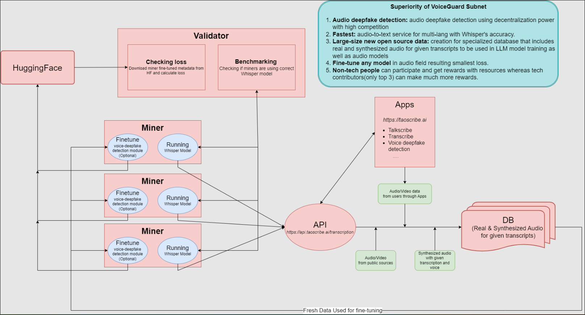

<div align="center">

# **VoiceGuard Subnet** <!-- omit in toc -->



[](https://discord.com/channels/799672011265015819/1161765231953989712)
[](https://opensource.org/licenses/MIT) 

---

### Decentralized Audio-Deepfake Detection AI on the Bittensor Network<!-- omit in toc -->

[Discord](https://discord.com/channels/799672011265015819/1161765231953989712)  •  [Subnet Status](https://x.taostats.io/subnet/44)
</div>

---
- [Introduction](#introduction)
- [Installation](#installation)
- [Running](#running)
  - [Running subtensor locally](#before-you-proceed)
  - [Running miner](#running-miner)
  - [Running validator](#running-validator)
- [License](#license)


# Introduction

```text
Welcome to the VoiceGuard Subnet on the Bittensor network, your cutting-edge solution against voice deepfakes. This subnet offers robust voice fake detection and high-speed, accurate transcriptions for YouTube videos, while also providing a specialized database for training voice deepfake detection models.
```

<br><br>

# Installation
**Python version should be over 3.10.**
## Bittensor

```bash
/bin/bash -c "$(curl -fsSL https://raw.githubusercontent.com/opentensor/bittensor/master/scripts/install.sh)"
```

### Clone the repository from Github
```bash
git clone https://github.com/Cazure8/voiceguard-subnet
```

### Install package dependencies for the repository
```bash
cd voiceguard-subnet
python3 -m pip install -r requirements.txt
python3 -m pip install -e .
```

### Install external packages
```bash
sudo apt-get update
sudo apt-get install ffmpeg
sudo apt-get install espeak
sudo apt install libsox-dev
```

### Download datasets for scoring
```bash
python3 voiceguard/utils/download.py
```

### Install `pm2`
```bash
apt update && apt upgrade -y
apt install nodejs npm -y
npm i -g pm2
```

### Using proxy(Optional but strongly recommended)
```text
All validators and miners are strongly recommended to use a proxy to circumvent YouTube's download limitations and ensure reliable vtrust/trust. You have the option to set up your own proxy server. Alternatively, if you prefer using a proxy service, you can obtain a paid version rotating proxy, for example, from SmartProxy Dashboard(https://dashboard.smartproxy.com/).
Get the rotating proxy url and put that it in .env file. Sample file .env.sample is already there in the codebase.
```
---

<br><br>

# Running

## Running subtensor locally

### Install Docker
```bash
apt install docker.io -y
apt install docker-compose -y
```

### Run Subtensor locally
```bash
git clone https://github.com/opentensor/subtensor.git
cd subtensor
docker-compose up --detach
```

#### Newer versions of Subtensor
The latest versions of Subtensor are a bit different than explained above, please check the official guide for detailed instructions: https://github.com/opentensor/subtensor/blob/main/docs/running-subtensor-locally.md


## Miner
```text
Miners' Responsibilities:

General Participation: Every miner is required to operate the Whisper Large model, facilitating a fine-tuned API for database generation and interactive video functions. This is accessible to non-technical individuals with moderate resources. Seventy percent of total rewards are distributed among these contributors.
Specialized Contribution: Miners with AI expertise may opt to train advanced detection models using our provided database. The top three performers in this category will share thirty percent of the total rewards. Note: These miners must also maintain the Whisper model to ensure seamless API functionality.
```

### Minimum Hardware Requirements for Miners
To participate effectively as a miner in the voiceguard Subnet, your system should meet the following **minimum** requirements:

- **Network Speed**:  **1Gbps**
- **GPU**: **20GVRAM**

### Run the miner with `pm2` for normal contributors
```bash
 # To run the miner
pm2 start neurons/miner.py --name miner --interpreter python3 -- 
    --netuid # the subnet netuid, default = 
    --subtensor.network # the bittensor chain endpoint, default = finney, local, test (highly recommend running subtensor locally)
    --wallet.name # your wallet coldkey name, default = default
    --wallet.hotkey # your wallet hotkey name, default = default
    --axon.ip # your IP
    --axon.port # the port you allowed
    --logging.debug # run in debug mode, alternatively --logging.trace for trace mode
    --batch_size # the number of data points processed in a single iteration, default = 12
    --device # the device will be used for model training, default = gpu
```

```bash
# simple Example
pm2 start neurons/miner.py --interpreter python3 -- --netuid 44 --wallet.name myminer --wallet.hotkey myhotkey
```

### Run the miner for AI model trainers
```bash
python3 miner_model/upload_model.py --hf_repo_id HF_REPO --wallet.name WALLET  --wallet.hotkey HOTKEY --model_dir PATH_TO_MODEL   
```
<br>

## Validator

```text
Validators' Roles:

Performance Evaluation: Validators assess miners based on the response time and accuracy of their APIs.
Model Optimization: They periodically review trained data and calculate loss metrics to enhance model performance.
```

### Run the validator with `pm2`
```bash
# To run the validator
pm2 start neurons/validator.py --interpreter python3 -- --netuid 44 --subtensor.network <LOCAL/FINNEY/TEST> --wallet.name <WALLET NAME> --wallet.hotkey <HOTKEY NAME> --axon.ip <YOUR IP> --axon.port <YOUR PORT>
```

```bash
# simple Example
pm2 start neurons/validator.py --interpreter python3 -- --netuid 44 --wallet.name myvalidator --wallet.hotkey myhotkey
```
<br>

# License
This repository is licensed under the MIT License.
```text
# The MIT License (MIT)
# Copyright © 2024 Yuma Rao

# Permission is hereby granted, free of charge, to any person obtaining a copy of this software and associated
# documentation files (the “Software”), to deal in the Software without restriction, including without limitation
# the rights to use, copy, modify, merge, publish, distribute, sublicense, and/or sell copies of the Software,
# and to permit persons to whom the Software is furnished to do so, subject to the following conditions:

# The above copyright notice and this permission notice shall be included in all copies or substantial portions of
# the Software.

# THE SOFTWARE IS PROVIDED “AS IS”, WITHOUT WARRANTY OF ANY KIND, EXPRESS OR IMPLIED, INCLUDING BUT NOT LIMITED TO
# THE WARRANTIES OF MERCHANTABILITY, FITNESS FOR A PARTICULAR PURPOSE AND NONINFRINGEMENT. IN NO EVENT SHALL
# THE AUTHORS OR COPYRIGHT HOLDERS BE LIABLE FOR ANY CLAIM, DAMAGES OR OTHER LIABILITY, WHETHER IN AN ACTION
# OF CONTRACT, TORT OR OTHERWISE, ARISING FROM, OUT OF OR IN CONNECTION WITH THE SOFTWARE OR THE USE OR OTHER
# DEALINGS IN THE SOFTWARE.
```
