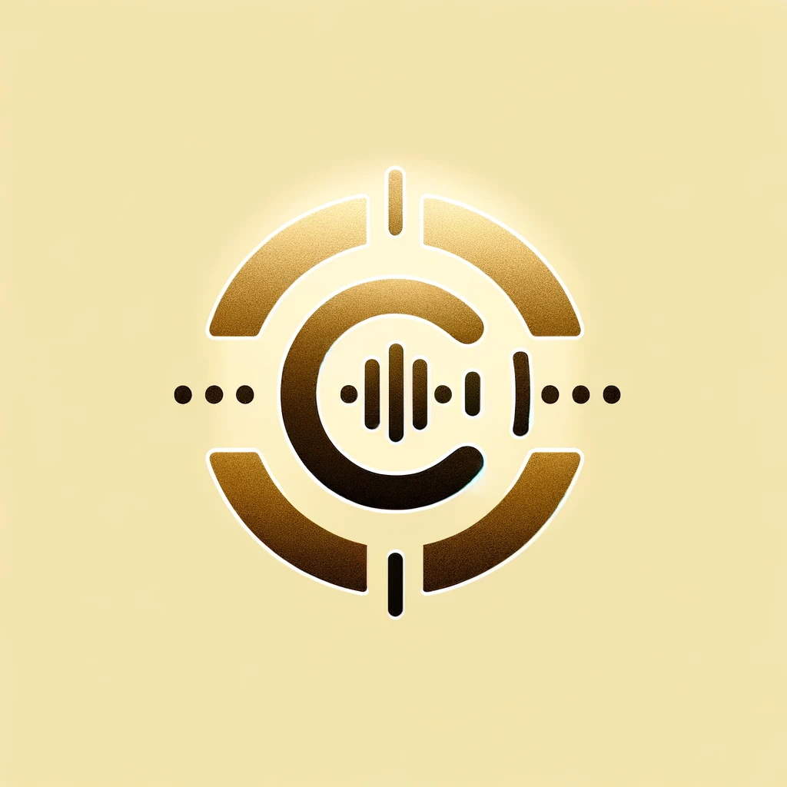

<div align="center">

# **Transcription Subnet** <!-- omit in toc -->



[](https://discord.com/channels/799672011265015819/1161765231953989712)
[](https://opensource.org/licenses/MIT) 

---

### Decenteralized AI combined auido-to-speech incentivized internet in Bittensor network<!-- omit in toc -->

[Discord](https://discord.com/channels/799672011265015819/1161765231953989712)  •  [Subnet Status](https://taostats.io/subnets/netuid-11)
</div>

---
- [Introduction](#introduction)
- [Installation](#installation)
- [Running](#running)
  - [Running subtensor locally](#before-you-proceed)
  - [Running miner](#running-miner)
  - [Running validator](#running-validator)
- [Writing your own incentive mechanism](#writing-your-own-incentive-mechanism)
- [License](#license)


# Introduction

```text
Welcome to the Transcription Subnet, a pioneering decentralized AI network within the Bittensor ecosystem, designed to revolutionize the way we interact with audio-to-text technology. This initiative is a leap forward in democratizing access to cutting-edge AI capabilities, fostering a thriving community where contributors are incentivized for their valuable input.
At the heart of the Transcription Subnet are two key players: miners and validators. Miners are responsible for transcribing spoken language into accurate written text using advanced speech-to-text models, while validators ensure the quality and reliability of these transcriptions. This synergetic process not only makes audio content universally accessible and searchable but also significantly amplifies its value across diverse sectors.
Our current implementation leverages the Wave2Vec 2.0 model by Facebook AI, known for its exceptional transcription performance. We utilize rich audio datasets like LibriSpeech for training and benchmarking, ensuring robust and versatile language understanding. As we evolve, we plan to integrate additional models and datasets, like Mozilla’s Common Voice, to further enhance our capabilities.
The effectiveness of miners in our network is heavily influenced by their computational resources. Higher-performing GPUs lead to more accurate and swift transcriptions, which in turn yield better rewards within the Bittensor network. We encourage participants to leverage good hardware to maximize their contributions and benefits.
This repository is your comprehensive guide to joining and excelling in the Transcription Subnet. Whether you aim to be a miner or a validator, you’ll find all the resources and instructions needed to embark on this journey.
Dive into the following sections for detailed insights on installation, operation, and contribution to the Transcription Subnet. Your participation and contributions are not just valued; they are essential to the growth and success of this exciting endeavor. Join us in shaping the future of audio transcription technology!
```

<br><br>

# Installation

## Bittensor

```bash
/bin/bash -c "$(curl -fsSL https://raw.githubusercontent.com/opentensor/bittensor/master/scripts/install.sh)"
```

## Clone the repository from Github
```bash
git clone https://github.com/Cazure8/transcription-subnet
```

## Install package dependencies for the repository
```bash
cd transcription-subnet
apt install python3-pip -y
python3 -m pip install -e .
```

## Install `pm2`
```bash
apt update && apt upgrade -y
apt install nodejs npm -y
npm i -g pm2
```
---

<br><br>

# Running

## Running subtensor locally

### Install Docker
```bash
apt install docker.io -y
apt install docker-compose -y
```

### Run Subtensor locally
```bash
git clone https://github.com/opentensor/subtensor.git
cd subtensor
docker-compose up --detach
```

## Miner
```text
In our innovative transcription subnet, miners are at the forefront of converting spoken language into written text. By leveraging the state-of-the-art Wave2Vec 2.0 model, our miners are tasked with delivering highly accurate and efficient transcriptions. This is a crucial step in making audio content universally accessible and easily searchable, thus significantly enhancing its value in various applications.
```

### As a miner in this subnet, your role involves two primary responsibilities:
1. **Training**:  Continuously train the Wave2Vec 2.0 model on your machine using a diverse range of publicly available audio datasets like LibriSpeech. This ongoing training process is vital for improving the model's accuracy and your success as a miner in the network.
2. **Processing Requests**:  Concurrently handle transcription requests from validators. You will receive audio data, convert it into text using the trained model, and respond back with transcriptions. Efficient and accurate responses will result in better rewards.


### Minimum Hardware Requirements for Miners
To participate effectively as a miner in the Transcription Subnet, your system should meet the following **minimum** requirements:

- **Hard Drive**: **500GB** (SSD recommended for faster data access and processing)
- **Network Speed**:  **100Mbps** (for efficient data transmission to and from the network)
- **RAM**: **2GB** (8GB or more recommended for optimal performance)
- **GPU**: **NVIDIA GTX 1060 or equivalent** (Higher-end GPUs like RTX series are recommended for faster training and processing)

These requirements are set to ensure that miners can handle the intensive tasks of model training and audio transcription efficiently. Miners with higher-spec systems may experience better performance and potentially higher rewards due to faster and more accurate transcriptions.

### Download datasets used in model training
```bash
python3 transcription/utils/download.py
```
### Run the miner with `pm2`

```bash
# To run the miner
pm2 start neurons/miner.py --interpreter python3 -- --netuid 11 --subtensor.network <LOCAL/FINNEY/TEST> --wallet.name <WALLET NAME> --wallet.hotkey <HOTKEY NAME>
```
<br>

## Validator

```text
Validators are essential to the integrity and efficiency of our transcription subnet. They are responsible for assessing the quality and accuracy of the transcriptions provided by miners. Here’s an overview of their crucial role:
Validators frequently dispatch a variety of audio clips to miners, covering a wide range of languages, dialects, and audio qualities. This diverse array of samples ensures that miners are adept at handling a broad spectrum of transcription challenges. Validators then meticulously evaluate the transcriptions returned by miners, focusing on accuracy, speed, and adherence to context.
The scoring process by validators is rigorous and fair, aiming to objectively assess each miner's performance. This evaluation is not just about the literal accuracy of the transcriptions, but also about understanding the nuances of spoken language and context. Validators contribute significantly to the continuous improvement of transcription models, driving the entire subnet towards excellence.
In the transcription subnet, validators thus uphold the highest standards of performance. Their diligent work ensures that the subnet remains a reliable and authoritative source for converting audio content into accurate text, thereby enhancing the overall value and usability of spoken data.
```

### Download dataset for transcription scoring
```bash
python3 -m spacy download en_core_web_md
python3 transcription/utils/download.py
```

### Install external ffmpeg package
```bash
sudo apt-get update
sudo apt-get install ffmpeg
```

### Run the validator with `pm2`
```bash
# To run the validator
pm2 start neurons/validator.py --interpreter python3 -- --netuid 11 --subtensor.network <LOCAL/FINNEY/TEST> --wallet.name <WALLET NAME> --wallet.hotkey <HOTKEY NAME>
```


## License
This repository is licensed under the MIT License.
```text
# The MIT License (MIT)
# Copyright © 2023 Yuma Rao

# Permission is hereby granted, free of charge, to any person obtaining a copy of this software and associated
# documentation files (the “Software”), to deal in the Software without restriction, including without limitation
# the rights to use, copy, modify, merge, publish, distribute, sublicense, and/or sell copies of the Software,
# and to permit persons to whom the Software is furnished to do so, subject to the following conditions:

# The above copyright notice and this permission notice shall be included in all copies or substantial portions of
# the Software.

# THE SOFTWARE IS PROVIDED “AS IS”, WITHOUT WARRANTY OF ANY KIND, EXPRESS OR IMPLIED, INCLUDING BUT NOT LIMITED TO
# THE WARRANTIES OF MERCHANTABILITY, FITNESS FOR A PARTICULAR PURPOSE AND NONINFRINGEMENT. IN NO EVENT SHALL
# THE AUTHORS OR COPYRIGHT HOLDERS BE LIABLE FOR ANY CLAIM, DAMAGES OR OTHER LIABILITY, WHETHER IN AN ACTION
# OF CONTRACT, TORT OR OTHERWISE, ARISING FROM, OUT OF OR IN CONNECTION WITH THE SOFTWARE OR THE USE OR OTHER
# DEALINGS IN THE SOFTWARE.
```
